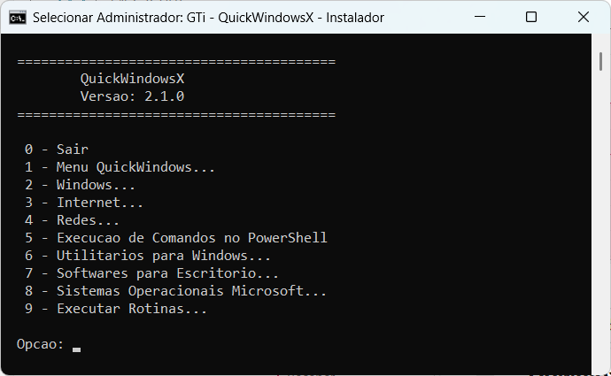

# QuickWindowsX

Menu interativo para agilizar instalações, rotinas e configurações no Windows durante formatação ou manutenção de computadores.

Versão atual: **2.3.0**

[](#rotinas-para-instala%C3%A7%C3%B5es-padr%C3%A3o)

---

## O que é

QuickWindowsX é a segunda geração do QuickWindows, reescrita do zero em Python 3. Mantém a mesma proposta — agilizar o trabalho de campo do técnico de informática — mas com uma arquitetura completamente nova: motor de menus em Python, instalador genérico único, URLs centralizadas e suporte nativo a rotinas em lote.

---

## Instalação

### Via PowerShell (recomendado)

Execute o seguinte comando no **Windows PowerShell como administrador**:

```powershell
irm qwx.gti1.com.br | iex
```

> Quando você executa `irm qwx.gti1.com.br | iex`, o PowerShell realiza duas ações:
>
> 1. **`irm`** (alias de `Invoke-RestMethod`) — busca o script `install.ps1` hospedado em `qwx.gti1.com.br` diretamente da internet.
> 2. **`iex`** (alias de `Invoke-Expression`) — executa o conteúdo baixado na memória, sem salvar arquivo em disco.
>
> ### O que o instalador faz
>
> 1. Verifica se está rodando como administrador — se não estiver, reinicia elevado automaticamente.
> 2. Cria o diretório `%USERPROFILE%\GTiSupport\` para logs e ícone.
> 3. Cria o atalho **GTi Support QWX** na Área de Trabalho.
> 4. Baixa o QuickWindowsX do GitHub para `%TEMP%\QuickWindowsX\`.
> 5. Instala o Python 3 automaticamente (se não estiver instalado).
> 6. Inicia o menu interativo.
>
> Nas execuções seguintes, basta clicar no atalho **GTi Support QWX** na Área de Trabalho ou repetir o mesmo comando.

### Instalação manual

1. Baixe o repositório como ZIP pelo GitHub e extraia para um diretório de sua escolha.
2. Certifique-se de que o **Python 3.8 ou superior** está instalado.
   - Download: https://www.python.org/downloads/
   - Durante a instalação, marque **"Add Python to PATH"**.
3. Clique duas vezes em **`run.cmd`** (eleva para administrador automaticamente).

### Se quiser salvar o instalador

```powershell
Invoke-WebRequest -Uri "https://qwx.gti1.com.br" -OutFile "$env:TEMP\install.ps1"
& "$env:TEMP\install.ps1"
```

### Hospedagem do `install.ps1` (Apache / cPanel)

Para que `irm qwx.gti1.com.br | iex` funcione, o servidor Apache precisa servir `install.ps1` como índice padrão do diretório. Crie um arquivo `.htaccess` na raiz do diretório `qwx/` no hospedeiro com o seguinte conteúdo mínimo:

```apache
DirectoryIndex install.ps1
```

> **Como funciona:** sem essa diretiva, o Apache procura por `index.html`, `index.php` etc. e retorna 403 ou a lista do diretório quando nenhum é encontrado. Com `DirectoryIndex install.ps1`, uma requisição GET ao domínio raiz serve o script PowerShell — que é exatamente o que o `irm` espera receber.
>
> O cPanel costuma gerar automaticamente um bloco extra no `.htaccess` (handler de PHP via `mime_module`). Esse bloco **não é necessário** para o funcionamento do instalador; o único campo obrigatório é a linha `DirectoryIndex install.ps1`.
>
> O mesmo padrão é usado pelo QuickWindows: `public_html/qw/.htaccess` contém `DirectoryIndex menu.ps1`.

---

## Estrutura

```
QuickWindowsX/
├── install.ps1         ← instalador remoto (irm qwx.gti1.com.br | iex)
├── run.cmd             ← executa no Windows (eleva para administrador)
├── setup.ps1           ← configura o ambiente antes do menu
├── main.py             ← ponto de entrada Python
├── version.json        ← versão do projeto
├── config.json         ← configurações (título da janela, beeps)
├── urls.json           ← URLs de todos os pacotes instaláveis
├── README.md
└── src/
    ├── app.py          ← inicialização e loop principal
    ├── boot.py         ← verificação de ambiente na inicialização
    ├── menu.py         ← motor do menu principal
    ├── screens.py      ← telas e ações de cada sessão
    ├── installer.py    ← bridge Python → PowerShell para instalações
    ├── exceptions.py   ← exceções internas (ex.: Recarregar)
    └── run_package.ps1 ← executor genérico de pacotes (EXE/MSI/ZIP)
```

---

## Sessões do menu

| # | Sessão |
|---|--------|
| 1 | Menu QuickWindowsX (atualizar, deletar, recarregar, documentação) |
| 2 | Windows (desligar, reiniciar, agendar, atualizar, configurações, atalhos, BIOS) |
| 3 | Internet (AnyDesk, RustDesk, HopToDesk, Edge, Chrome, Firefox, Opera, VNC, Transmission, IDM…) |
| 4 | Redes (IP público, IP local, traceroute) |
| 5 | Execução de Comandos no PowerShell |
| 6 | Utilitários para Windows (34 opções: compactadores, PDF, partições, backup, limpeza, diagnóstico…) |
| 7 | Softwares para Escritório (Office 365, 2016–2019, 2019–2021, atalhos) |
| 8 | Sistemas Operacionais Microsoft (Windows 10 x32/x64, Windows 11 x64) |
| 9 | Executar Rotinas (execução em lote por números separados por vírgula) |

---

## Rotinas para instalações padrão

Rotinas formuladas pela equipe de TI da GLOBAL TEC Informática para uso no QuickWindowsX.

### Formatação remota

```bash
256,2512,616,81 # Windows 10 22H2 BrazilianPortuguese x32
256,2512,616,82 # Windows 10 22H2 BrazilianPortuguese x64
256,2512,616,83 # Windows 11 24H2 BrazilianPortuguese x64
┬── ┬─── ┬── ┬─
│   │    │   │
└───┼────┼───┼──┤ # Gerenciamento de Discos (diskmgmt.msc)
    │    │   │  │ Recurso do Windows para particionar o
    │    │   │  │ dispositivo de armazenamento para colocar a ISO.
    │    │   │
    └────┼───┼──┤ # Gerenciar arquivos e pastas
         │   │  │ Copiar ou mover os arquivos importantes do
         │   │  │ usuário para a unidade "D:" e evitar perdas
         │   │  │ inesperadas.
         │   │
         └───┼──┤ # WinToHDD
             │  │ Software que faz a reinstalação do sistema.
             │  │ A opção a qual deve ser utilizada é para
             │  │ reinstalar o sistema.
             │
             └──┤ # Sistemas Operacionais Microsoft…
                │ Essa rotina indica qual das ISOs será baixada.
                │ O técnico informará para que possa ser baixada
                │ na unidade "D:\_GTi_Support_" por exemplo.
```

### Após formatação

```
Rotina  Descrição
-------------------------------------------------
26      Criar atalhos para 'Desligar e Reiniciar'
2510    Editar Configurações do Plano (powercfg.cpl)
2513    Configurações do Windows (ms-settings)
36      Navegador Microsoft Edge
311     Navegador Mozilla Firefox
37      Navegador Google Chrome
63      WinRAR
68      VLC Media Player
66      Acrobat Reader DC
71      Microsoft Office 365
74      Criar atalhos para Apps do Office 2021
627     Windows Update Activation
626     Limpar Arquivos Temporários
-------------------------------------------------
```

Copie as rotinas a executar no QuickWindowsX:

```bash
26,2510,2513,36,311,37,63,68,66,71,74,627,626
```

---

## Senha de acesso

O QuickWindowsX permite configurar uma senha de **6 ou mais caracteres** (letras, números e caracteres especiais como `@`, `!`, `$`) para proteger o acesso ao menu. Útil quando o atalho é deixado na Área de Trabalho após um serviço — evita que usuários leigos executem ações indevidas.

### Configurar senha

Na **primeira execução**, o QWX perguntará se você deseja ativar a proteção por senha. Você pode pular essa etapa e configurar depois pelo menu:

```
1 - Menu QuickWindows... > 5 - Gerenciar Senha de Acesso
```

### Alterar ou remover a senha

Acesse o mesmo caminho acima. Para remover a senha, será solicitada a senha atual como confirmação.

### Recuperação de senha (senha esquecida)

A senha é armazenada (criptografada) no arquivo:

```
%USERPROFILE%\GTiSupport\qwx_auth.json
```

Abra esse arquivo com qualquer editor de texto e **apague o valor entre aspas** na linha `"senha"`, deixando-a assim:

```json
{
  "senha": ""
}
```

Salve o arquivo. Na próxima execução o QWX iniciará sem pedir senha.

---

## Histórico de versões

> As versões **1.x.x** correspondem ao **QuickWindows** (base original em PowerShell/CMD).
> A versão **2.0.0** marca o início do **QuickWindowsX** (reescrita em Python 3).

- **v2.3.0** 2026-06-24 — Protecao por senha de 6 digitos numericos: na primeira execucao o QWX oferece ativar a senha; em execucoes seguintes, se senha configurada, solicita autenticacao antes de exibir o menu (3 tentativas); gerenciador de senha em "Menu QuickWindows > Gerenciar Senha de Acesso" permite ativar, alterar ou remover a senha. Arquivo de senha armazenado em %USERPROFILE%\GTiSupport\qwx_auth.json (instrucoes de recuperacao no README). Modulo src/auth.py adicionado.
- **v2.2.0** 2026-06-23 — Verificacao de atualizacao disponivel na inicializacao do boot e no cabecalho do menu principal: exibe aviso em amarelo quando ha versao mais recente no repositorio, com instrucao de como atualizar. Opcao "Deletar QuickWindowsX" agora remove tambem o atalho "GTi Support QWX" da Area de Trabalho apos a exclusao do diretorio.
- **v2.1.0** 2026-06-23 — Instalador remoto `install.ps1` via `irm qwx.gti1.com.br | iex`: eleva para administrador, cria atalho **GTi Support QWX** na Área de Trabalho com ícone, baixa o repositório do GitHub e inicia o menu. Ícone `Images/QuickWindowsX.ico` adicionado. Removida definição de fundo preto de `setup.ps1`. Removido código ANSI dim de `boot.py` (renderizava azul no conhost do Windows).
- **v2.0.0** 2026-06-23 — **QuickWindowsX**: reescrita completa em Python 3. Motor de menus orientado a dados (`_submenu`), instalador genérico único (`run_package.ps1`) para EXE/MSI/ZIP, URLs centralizadas em `urls.json`, config.json com título da janela e beeps, rotinas em lote com numeração por sessão, logs em `%USERPROFILE%\GTiSupport`, desligamento agendado polimórfico, sessão Redes, execução de comandos PowerShell, suporte a desenvolvimento em Linux.
- **v1.84.0** 2025-09-09 — Opção para download e execução de WizTree e WizTree64.
- **v1.83.5** 2025-08-28 — Correções de erros no código.
- **v1.83.4** 2025-04-04 — Atualização dos links das ISOs Win10 22H2 x32v1, Win10 22H2 x64v1 e Win11 24H2 x64.
- **v1.83.3** 2025-03-08 — Atualização da URL do Google Earth Pro e remoção da instalação do Moo0 do processo de setup.
- **v1.83.2** 2024-10-30 — Ajuste no reset do AnyDesk: sessões recentes e miniaturas de PCs remotos são preservadas.
- **v1.83.1** 2024-09-06 — Correção das descrições das ISOs do Windows 10 e 11 Pro na sessão Sistemas Operacionais.
- **v1.83.0** 2024-09-06 — Script de criação de atalhos para computadores remotos via AnyDesk na Área de trabalho.
- **v1.82.1** 2024-08-28 — Verificação da existência do arquivo zip antes de apagar.
- **v1.82.0** 2024-08-20 — Opção para abrir o README do QuickWindows no repositório Git na sessão Menu QuickWindows.
- **v1.81.3** 2024-08-20 — Resolvido o método de download e execução do script do QuickWindows.
- **v1.81.2** 2024-08-15 — Ajustes nas linhas que contêm o trecho %~dp0Package_Installers.
- **v1.81.1** 2024-08-15 — Ajustes no código do menu.ps1: linha comentada e textos traduzidos.
- **v1.81.0** 2024-08-15 — Verificação e finalização do processo SystemMonitor64 se estiver em execução.
- **v1.80.0** 2024-08-12 — Opção para reiniciar e entrar na BIOS da placa-mãe.
- **v1.79.0** 2024-08-06 — Opção para download e execução do Moo0 System Monitor Portable.
- **v1.78.3** 2024-08-02 — Correção da URL para download do MiniTool Partition Wizard.
- **v1.78.2** 2024-08-01 — Chamada das URLs do JSON nos utilitários que estavam faltando.
- **v1.78.1** 2024-07-31 — Remoção do trecho que imprimia no terminal a informação de logs criados.
- **v1.78.0** 2024-07-31 — Arquivo JSON centralizado para todas as URLs dos pacotes.
- **v1.77.0** 2024-07-30 — Inclusão das opções da sessão de Redes nas Rotinas.
- **v1.76.1** 2024-07-29 — Ajustes no tamanho da janela e no estreitamento das colunas da tabela de rotinas.
- **v1.76.0** 2024-07-28 — Chave para habilitar ou desabilitar a execução do software de acesso remoto.
- **v1.75.1** 2024-07-28 — Correção de bugs nos níveis de chamada do arquivo de função de logs.
- **v1.75.0** 2024-07-28 — Registro de logs em todos os arquivos de execução do QuickWindows.
- **v1.74.1** 2024-07-26 — Correção de bug após instalação do Git onde o PowerShell precisava ser reinicializado.
- **v1.74.0** 2024-07-26 — Função para simular a exibição de uma linha com status OK no processo de instalação.
- **v1.73.3** 2024-07-24 — Correção de erro no final da instalação do Git no arquivo menu.ps1.
- **v1.73.2** 2024-07-24 — Atualização do arquivo de instalação do Adobe para a versão do Windows 10.
- **v1.73.1** 2024-07-24 — Ajuste para finalização dos processos do Adobe no PowerShell antes de continuação do script.
- **v1.73.0** 2024-07-24 — Opção para baixar e executar o Open Hardware Monitor na sessão Utilitários para Windows.
- **v1.72.0** 2024-07-12 — Função que cria e registra logs do sistema em GTiSupport.
- **v1.71.3** 2024-07-12 — Melhoria na instalação do Git eliminando o método via winget.
- **v1.71.2** 2024-07-11 — Ajuste na remoção do arquivo baixado em Temp com verificação de existência.
- **v1.71.1** 2024-07-06 — Correção das linhas que apagam os instaladores do Office após instalação.
- **v1.71.0** 2024-07-06 — Abertura do Gerenciador de Tarefas para monitorar o desempenho do download.
- **v1.70.2** 2024-07-05 — Download do instalador via BitsTransfer e instalação silenciosa do Git.
- **v1.70.1** 2024-07-03 — Correção na remoção do instalador do Git no diretório Temp.
- **v1.70.0** 2024-06-30 — Definição do título da janela do Prompt a partir do config.json.
- **v1.69.0** 2024-06-27 — Os recursos do Windows passaram a ser executados por arquivo .ps1 dedicado.
- **v1.68.0** 2024-06-26 — Instalação silenciosa do Git via Winget.
- **v1.67.0** 2024-06-17 — Novo comando para atualização do PowerShell.
- **v1.66.1** 2024-06-17 — Correção de bug onde config.json não era encontrado quando executado de outro local.
- **v1.66.0** 2024-06-16 — Configurações centralizadas no arquivo config.json no diretório raiz.
- **v1.65.2** 2024-06-14 — Ajuste na largura da janela do terminal Windows PowerShell para 120 colunas.
- **v1.65.1** 2024-04-18 — Ajuste da lista de rotinas para melhor visualização.
- **v1.65.0** 2024-04-17 — Criação dos atalhos dos aplicativos Microsoft Office na Área de trabalho do Windows.
- **v1.64.0** 2024-04-16 — Opção para Gerenciador de Energia (Desligar ou Reiniciar) na sessão Windows.
- **v1.63.0** 2024-04-14 — Criação de dois atalhos na Área de trabalho do Windows: Desligar e Reiniciar.
- **v1.62.0** 2024-04-11 — Opção para baixar e instalar o SiberiaProg-CH341A, programa de gravação de EPROM.
- **v1.61.0** 2024-03-31 — Opção Reset AnyDesk na sessão Internet / Acesso Remoto.
- **v1.60.0** 2024-03-29 — Battery Report na sessão Utilitários para Windows.
- **v1.59.0** 2024-03-24 — Windows Update Activation e Revo Uninstaller Portable na sessão Utilitários para Windows. Ícone de execução criado na Área de trabalho.
- **v1.58.0** 2024-03-21 — Download e execução de CPU-Z Portable em Utilitários para Windows.
- **v1.57.0** 2024-03-21 — Opção para instalação do Crystal Disk Info na sessão Utilitários para Windows.
- **v1.56.1** 2024-03-14 — Correção do nome Rufus (estava escrito Rufos) na sessão de utilitários.
- **v1.56.0** 2024-03-14 — Opção para execução de Rotinas (múltiplas ações em lote).
- **v1.55.1** 2024-03-08 — Condição com chave para escolher qual comando executar para atualizar o PowerShell na sessão Windows.
- **v1.55.0** 2024-02-21 — Opção para instalação de Cobian Backup na sessão Utilitários para Windows / Backup e Restauração.
- **v1.54.0** 2024-02-12 — Opção para instalação de CPU-Z na sessão Utilitários para Windows.
- **v1.53.0** 2024-02-12 — Opção para instalação de Driver Booster Free na sessão Utilitários para Windows.
- **v1.52.0** 2024-02-08 — Opção para baixar o HopToDesk na sessão Internet / Acesso Remoto.
- **v1.51.0** 2024-02-04 — Opção para Informações do Sistema com PowerShell na sessão Windows / Acesso rápido às Configurações.
- **v1.50.0** 2024-02-03 — Opção para Compressão de arquivos / PowerShell Backup Automático (.zip) na sessão Utilitários para Windows.
- **v1.49.0** 2024-01-25 — Opção para instalação de Foxit PDF Reader na sessão Utilitários para Windows / Leitores de PDF.
- **v1.48.0** 2024-01-25 — Opção para instalação de 7-Zip na sessão Utilitários para Windows / Compactadores.
- **v1.47.0** 2024-01-20 — Versão inicial da sessão Software de gerenciamento de partições.
- **v1.46.1** 2024-01-20 — Correção do nome do arquivo .ps1 que baixa e executa o Revo Uninstaller.
- **v1.46.0** 2024-01-19 — Exibição da quantidade de arquivos temporários apagados na sessão Utilitários para Windows.
- **v1.45.0** 2024-01-18 — Verificação se o PowerShell está sendo executado como administrador no menu.ps1.
- **v1.44.0** 2024-01-15 — Opções para limpar o Spooler de Impressão e limpar Arquivos Temporários na sessão Utilitários para Windows.
- **v1.43.0** 2024-01-14 — Opção para executar Opções de pastas na sessão Windows / Acesso rápido às Configurações.
- **v1.42.0** 2024-01-08 — Comando para mudar a cor do plano de fundo do Windows PowerShell.
- **v1.41.1** 2023-12-29 — Modificação onde o PowerShell pergunta o local para salvar o instalador do DriverMax.
- **v1.41.0** 2023-12-29, Sandro de Souza Silva — Opção para instalação de DriverMax na sessão Utilitários para Windows.
- **v1.40.1** 2023-12-28 — Ajuste na execução do WinToHDD e correção do caminho do executável do AnyDesk.
- **v1.40.0** 2023-12-25 — Opção para instalação de Rufus na sessão Utilitários para Windows.
- **v1.39.0** 2023-12-16 — Todos os downloads modificados para emitir uma sequência de Beeps ao concluir.
- **v1.38.1** 2023-12-14 — Ajuste na logo GTi e no nome GLOBAL TEC Informática da tela inicial.
- **v1.38.0** 2023-12-13 — Emitir sequência de Beeps após downloads das ISOs dos sistemas operacionais.
- **v1.37.0** 2023-12-11 — Versão inicial das opções para baixar os Sistemas Operacionais da Microsoft.
- **v1.36.0** 2023-12-10 — Opção para informar uma URL e iniciar download direto via PowerShell na sessão Internet / Downloads.
- **v1.35.0** 2023-12-08 — Todos os downloads agora exibem barra de progresso via Start-BitsTransfer.
- **v1.34.0** 2023-12-06 — Opção para instalar o Hasleo WinToHDD Free na sessão Utilitários para Windows.
- **v1.33.2** 2023-12-06 — Informado o tamanho dos executáveis nos arquivos PS1.
- **v1.33.1** 2023-12-06 — Removidas as linhas de URL do GitHub desnecessárias.
- **v1.33.0** 2023-12-05 — Opção para agendar desligamento automático na sessão Windows.
- **v1.32.0** 2023-12-02 — Opção para instalação de Microsoft Office 365 na sessão Softwares para Escritório.
- **v1.31.0** 2023-12-01 — Opção para Gerenciador de Tarefas do Windows na sessão Windows.
- **v1.30.0** 2023-12-01 — Sessão Downloads dentro da sessão Windows e opção para instalação do Internet Download Manager.
- **v1.29.0** 2023-11-30 — Opção para Configurações do Windows na sessão Windows / Acesso rápido às Configurações.
- **v1.28.0** 2023-11-30 — Opção para instalação de Microsoft Office 2019 a 2021 na sessão Softwares para Escritório.
- **v1.27.0** 2023-11-30 — Opção para abrir Gerenciador de Arquivos com endereço específico na sessão Windows / Configurações / página 2.
- **v1.26.0** 2023-11-30 — Nova página para sessão Windows / Acesso rápido às Configurações (Page 1 e Page 2).
- **v1.25.0** 2023-11-30 — Sessão Software de congelamento do sistema concluída.
- **v1.24.0** 2023-11-30 — Opção para instalação de WinZip na sessão Utilitários para Windows.
- **v1.23.0** 2023-11-29 — Script de Interação: Janela de Comando Interativa para Execução de Comandos.
- **v1.22.1** 2023-11-29 — A opção Instalar AnyDesk na sessão Internet foi renomeada para Softwares de Acesso Remoto.
- **v1.22.0** 2023-11-29 — Sessão Utilitários para Windows com instaladores diversos.
- **v1.21.0** 2023-11-14 — Menu de acesso rápido a funcionalidades do Windows na sessão Windows.
- **v1.20.0** 2023-11-13 — Opção para instalar o visualizador Real VNC Viewer na sessão Internet.
- **v1.19.0** 2023-11-13 — Opção para instalar o navegador Mozilla Firefox na sessão Internet.
- **v1.18.0** 2023-11-13 — Opção para instalar o navegador Opera na sessão Internet.
- **v1.17.0** 2023-11-13 — Opção para instalar o Skype na sessão Internet.
- **v1.16.1** 2023-11-13 — Renomeadas as extensões dos arquivos .bat para .cmd.
- **v1.16.0** 2023-11-12 — Opção para instalar o Google Earth Pro na sessão Internet.
- **v1.15.1** 2023-11-12 — Correção: reescrito o script para baixar e executar o instalador do Microsoft Edge.
- **v1.15.0** 2023-11-11 — Opção para instalar o Google Chrome na sessão Internet.
- **v1.14.0** 2023-11-11 — Opção para instalar o Microsoft Edge na sessão Internet.
- **v1.13.0** 2023-11-11 — Versão inicial, opção para atualizar o PowerShell na sessão Windows.
- **v1.12.1** 2023-11-01 — Correção na linha de comando que apaga o arquivo de instalação do AnyDesk baixado.
- **v1.12.0** 2023-11-01 — Script PowerShell que ao informar um domínio retorna a rota da conexão na sessão Redes.
- **v1.11.0** 2023-11-01 — Execução Interativa de Comandos no PowerShell.
- **v1.10.1** 2023-11-01 — Correção da verificação da existência do AnyDesk no Windows na sessão Internet.
- **v1.10.0** 2023-11-01 — Opção para obter a rota de IP até a Google.com.
- **v1.9.0** 2023-11-01 — Opção para obter IP local na Sessão de Redes.
- **v1.8.0** 2023-11-01 — Opção para obter IP público na Sessão de Redes.
- **v1.7.0** 2023-11-01 — Versão inicial, Sessão de Redes para opções relacionadas à redes.
- **v1.6.0** 2023-10-31 — Sessão Internet, Instalação de AnyDesk.
- **v1.5.0** 2023-10-31 — Script para instalar o Winget via PowerShell.
- **v1.4.0** 2023-10-31 — Código PowerShell para atualizar softwares do Windows usando o comando winget.
- **v1.3.0** 2023-10-31 — Funcionalidade das opções Atualizar, Deletar e Recarregar o QuickWindows na Sessão Menu QuickWindows. Versão inicial do menu Session 2.
- **v1.2.0** 2023-10-31 — Adicionada a Sessão Windows e algumas opções.
- **v1.1.0** 2023-10-31 — Exibição da versão do QuickWindows no terminal.
- **v1.0.1** 2023-10-31 — Correções de alguns bugs e alterações na documentação README.md.
- **v1.0.0** 2023-10-28 — Versão inicial, menu de instalações de programas para Windows.